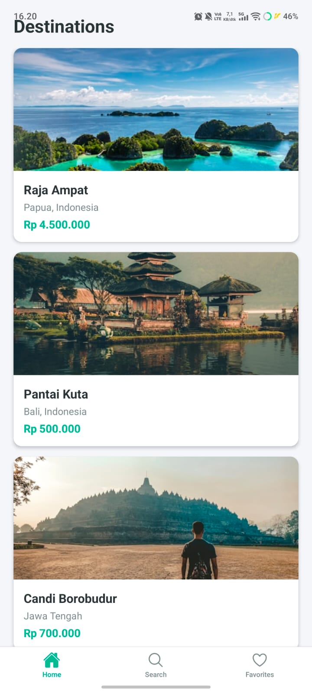
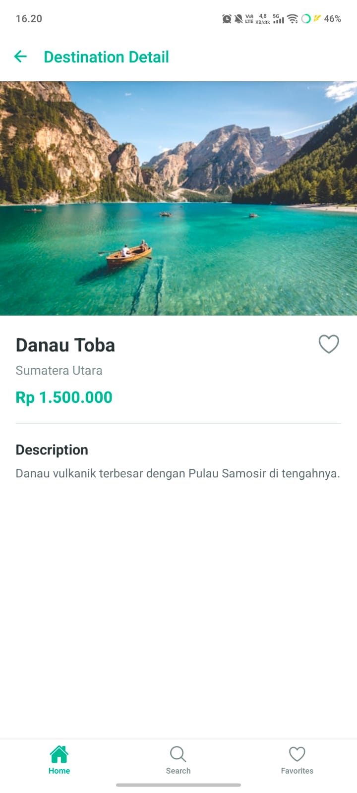

# Travel Buddy

Multi-screen React Native app dengan React Navigation.

## Features
- Bottom Tab Navigation (Home, Search, Favorites)
- Stack Navigator di Home tab (HomeScreen → DetailScreen)
- Route params untuk pass destination data
- FlatList dengan destinations
- @expo/vector-icons untuk tab icons

## Tech Stack
- React Native + Expo
- React Navigation 6
- StyleSheet
- @expo/vector-icons

## How to Run
1. npm install
2. npx expo start
3. Scan QR code di Expo Go

## Screenshots

## Author
[Maxwell Osse Tarigan]
